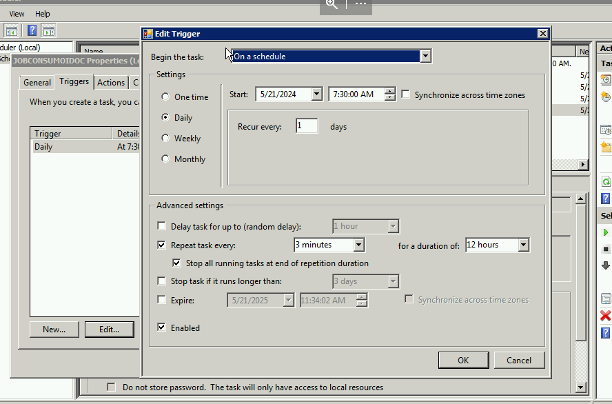

# Job para el consumo de IDOCS ODOO -> SAP

Para realizar esta tarea necesitamos usar el programa startrfc que viene en la instalación de SAP.
El job busca los archivos de texto que comiencen con el nombre WPUBON y WPUFIB ya que el comando startrfc toma todos los archivos de texto que caigan en la ubicación donde se le indique que tome la data.

Esto lo controlamos mediante un ciclo for el cual ejecuta un dir en el directorio para que traiga por separado cada grupo de archivos.

```batch title:Ciclo_For
for /f "tokens=*" %%a in ('dir "%directorio%\WPUBON*.txt" /b') do (##CODIGO##)
for /f "tokens=*" %%a in ('dir "%directorio%\WPUFIB*.txt" /b') do (##CODIGO##)
```

Este proceso se ejecuta siempre que existan archivos en la ruta definida.
Utilizando **dir %directorio%\*.txt > nul** devuelve dentro de la variable ERRORLEVEL un valor 1 para vació y 0 para el caso contrario

```batch title:Validar_Datos_en_directorio
dir %directorio%\*.txt > nul

IF %ERRORLEVEL% == 0 (##CÓDIGO##)
```

### Parámetros

Se creo un archivo que contiene las variables de entorno utilizadas.

La lista idocType contine los tipos de idocs que se permiten procesar en el la ejecucion del programa.

```batch title:Parámetros config.bat
@echo off

set server=10.0.0.10
set mand=300
set usr=usuario
set pwd=contrasena
set directorio=C:\InterfaceODOO\ENTRADA
set logPath=%directorio%\logs
set duplicatePath=%directorio%\duplicados
set today=%date:~10,4%%date:~4,2%%date:~7,2%
set logFile=%logPath%\%today%.log
set idocType=WPUBON,WPUFIB,WPUTAB,WPUWBW
```

### Tarea programada

Se programo el Job para que se ejecute a partir de las 7:30 AM Hasta las 7:30 PM. Se estará ejecutando en intervalos de 5 minutos.



### Logs

Dentro de la carpeta de logs se estará almacenando los datos de cada ejecución.

### Control de duplícados

Se implemento el control de duplicados diario. este control utiliza el archivo de log diario para saber si el archivo que se esta enviando ya ha sido cargado en el día. Esto implica que puedo volver a enviar una mismo idoc en días diferentes.

Los archivos que se identifiquen como duplicados se estaran almacenando en una carpeta de duplicados. renombrandolos con el dia y la hora en que se intento procesar el archivo.

### Código Fuente

```batch title:carga CargaIdocIN.bat
@echo off

CALL ./config.bat

IF NOT EXIST %directorio% mkdir %directorio%
dir %directorio%\*.txt > nul

IF %ERRORLEVEL% == 0 (
  IF NOT EXIST %logPath% mkdir %logPath%
  IF NOT EXIST %duplicatePath% mkdir %duplicatePath%

  echo [%date:~7,2%/%date:~4,2%/%date:~10,4% - %time:~0,8%] - Inicio >> %logFile%

  for %%f in (%idocType%) do (
    if NOT %%f == "" (
      for /f "tokens=*" %%a in ('dir "%directorio%\%%f*.txt" /b') do (
        if NOT %%a == "" (
          CALL :checkDuplicate "%%a"
        )
      )
    )
  )

  echo [%date:~7,2%/%date:~4,2%/%date:~10,4% - %time:~0,8%] - Fin >> %logFile%
  echo ************************************ >> %logFile%
)

:checkDuplicate
  findstr /C:" %~1" "%logFile%" >nul
  if %errorlevel% == 0 (
    if NOT %~1 == " " (
      echo [%date:~7,2%/%date:~4,2%/%date:~10,4% - %time:~0,8%] - Archivo %~1 ya procesado. >> "%logFile%"
      move "%directorio%\%~1" "%duplicatePath%\%date:~7,2%%date:~4,2%%date:~10,4%_%time:~0,2%%time:~0,2%%time:~6,2%_%~1"
    )
    exit /b 1
  ) else (
    echo procesando archivo %~1 >> %logFile%
    startrfc -h %server% -s 00 -u %usr% -p %pwd% -c %mand% -F EDI_DATA_INCOMING -E PATHNAME=%directorio%\%~1 -E PORT=IDOC >> %logFile%
    exit /b 0
  )
```
